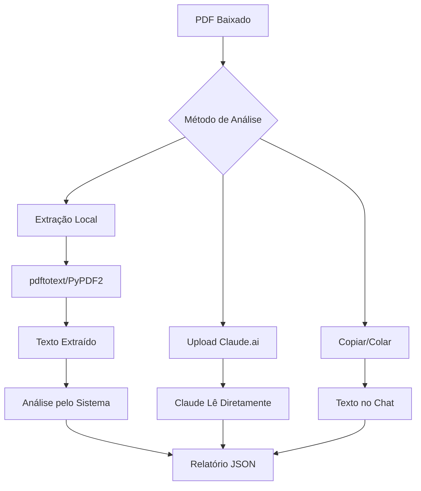

# 📊 Como Analisar PDFs no Sistema Chimpa Invest

## 🎯 Entendendo as Limitações

### O que o Claude PODE fazer:
1. **Analisar texto** que você fornecer
2. **Processar dados** estruturados
3. **Gerar insights** baseados em conteúdo
4. **Criar relatórios** formatados

### O que o Claude NÃO pode fazer diretamente:
1. **Ler arquivos binários** (PDFs, imagens) do sistema de arquivos
2. **Acessar URLs** externas
3. **Executar OCR** em imagens

## 🛠️ Soluções Disponíveis

### Opção 1: Análise Real Local (Recomendado)
Esta opção extrai o texto do PDF localmente e depois analisa.

#### Instalação das Ferramentas:

**Linux/WSL:**
```bash
# Instalar pdftotext (mais rápido e confiável)
sudo apt-get update
sudo apt-get install poppler-utils

# Instalar bibliotecas Python
pip install PyPDF2 pdfplumber
```

**Windows:**
1. Baixe Poppler: https://github.com/oschwartz10612/poppler-windows/releases
2. Extraia e adicione ao PATH
3. Ou use apenas as bibliotecas Python:
```bash
pip install PyPDF2 pdfplumber
```

**macOS:**
```bash
brew install poppler
pip install PyPDF2 pdfplumber
```

#### Como Usar:
```bash
python cvm_download_principal.py
# Escolher opção 10: Análise Real de PDFs
```

### Opção 2: Copiar e Colar
1. Abra o PDF em um leitor
2. Selecione e copie o texto
3. Cole no chat com o Claude
4. Peça a análise

### Opção 3: Usar Claude.ai (Interface Web)
1. Acesse https://claude.ai
2. Faça upload do PDF diretamente
3. Claude pode ler PDFs na interface web

## 📋 Fluxo do Sistema Atual



## 🚀 Guia Rápido

### 1. Baixar PDFs
```bash
python cvm_download_principal.py
# Opção 3: Baixar releases trimestrais
```

### 2. Instalar Ferramentas (uma vez)
```bash
# WSL/Linux
sudo apt-get install poppler-utils
pip install PyPDF2 pdfplumber
```

### 3. Analisar PDFs
```bash
python cvm_download_principal.py
# Opção 10: Análise Real de PDFs
```

## 📊 O que o Sistema Extrai

### Informações Básicas:
- Nome da empresa
- CNPJ
- Período do relatório
- Datas importantes

### Métricas Financeiras:
- Receita (BRL/USD)
- EBITDA e margem
- Lucro líquido
- Dívida líquida
- Geração de caixa

### Análise Qualitativa:
- Destaques operacionais
- Riscos identificados
- Tendências
- Guidance

## 🔧 Solução de Problemas

### Erro: "Não foi possível extrair texto"
**Causas:**
- Ferramentas não instaladas
- PDF protegido ou corrompido
- PDF é imagem escaneada

**Soluções:**
1. Instale as ferramentas necessárias
2. Tente abrir o PDF manualmente
3. Use OCR se for PDF escaneado

### Erro: "PDF não encontrado"
**Causas:**
- Ainda não baixou os PDFs
- Caminho incorreto

**Soluções:**
1. Execute o download primeiro (opção 3)
2. Verifique a pasta `documents/pending/`

## 💡 Dicas Avançadas

### Análise em Lote
```python
# Analisar todos os PDFs de uma pasta
from pathlib import Path
import analise_pdf_real

analyzer = analise_pdf_real.PDFAnalyzerReal()
for pdf in Path("documents/pending").glob("*.pdf"):
    result = analyzer.analyze_pdf(pdf)
    analyzer.display_analysis(result)
```

### Exportar para Excel
```python
import pandas as pd
import json

# Carregar análises
analises = []
for file in Path("cache_analises").glob("*.json"):
    with open(file) as f:
        analises.append(json.load(f))

# Criar DataFrame
df = pd.DataFrame(analises)
df.to_excel("analises_completas.xlsx", index=False)
```

## 🎯 Próximos Passos

1. **Curto Prazo**: Instalar ferramentas e testar
2. **Médio Prazo**: Automatizar análises periódicas
3. **Longo Prazo**: Integrar com APIs de mercado

## 📞 Suporte

Se tiver problemas:
1. Verifique se as ferramentas estão instaladas
2. Teste com um PDF simples primeiro
3. Veja os logs em `cache_analises/`

---

**Lembre-se**: O sistema atual extrai e analisa o texto dos PDFs. Para análise visual (gráficos, tabelas complexas), use o Claude.ai diretamente.