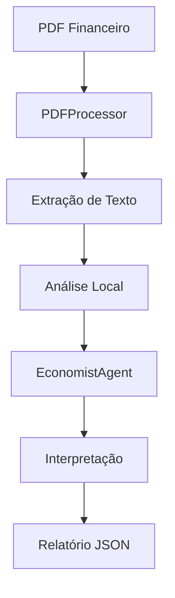

# 🤖 Sistema de Agente Economista - Guia de Uso

## 📋 O que é necessário para usar o sistema real

### 1. **Processamento de PDFs Local**

O sistema atualmente usa processamento local de PDFs com as seguintes ferramentas:

#### Opção A: Ferramentas de Sistema (Recomendado)
```bash
# Linux/WSL
sudo apt-get install poppler-utils tesseract-ocr tesseract-ocr-por

# macOS
brew install poppler tesseract tesseract-lang

# Windows
# Baixar de: https://github.com/oschwartz10612/poppler-windows
# E: https://github.com/UB-Mannheim/tesseract/wiki
```

#### Opção B: Bibliotecas Python
```bash
pip install -r requirements_agents.txt
```

### 2. **Uso com Claude (MCP Real)**

Para usar o Claude para analisar PDFs diretamente, você tem duas opções:

#### Opção 1: Fornecer o PDF na conversa
1. Abra o PDF que deseja analisar
2. Cole o conteúdo ou faça upload do arquivo
3. Peça análise específica

#### Opção 2: Usar a API do Claude
```python
# Exemplo de integração com API
import anthropic

client = anthropic.Client(api_key="sua-chave-api")

# Ler PDF
with open("release.pdf", "rb") as f:
    pdf_content = f.read()

# Enviar para análise
response = client.messages.create(
    model="claude-3-opus-20240229",
    messages=[{
        "role": "user",
        "content": "Analise este relatório financeiro..."
    }],
    attachments=[{
        "file": pdf_content,
        "media_type": "application/pdf"
    }]
)
```

### 3. **Como o Sistema Funciona Atualmente**



### 4. **Estrutura de Processamento**

1. **PDFProcessor** (`pdf_processor.py`):
   - Extrai texto usando pdftotext, PyPDF2 ou pdfplumber
   - Identifica seções do documento
   - Extrai métricas financeiras
   - Cacheia resultados

2. **EconomistAgent** (`economist_agent.py`):
   - Interpreta dados extraídos
   - Compara com benchmarks
   - Gera insights e recomendações

3. **FinancialKnowledge** (`financial_knowledge.py`):
   - Base de conhecimento do mercado brasileiro
   - Indicadores econômicos
   - Benchmarks setoriais

## 🚀 Como Usar

### 1. Instalar Dependências
```bash
# Instalar bibliotecas Python
pip install -r requirements_agents.txt

# Instalar ferramentas do sistema (opcional)
sudo apt-get install poppler-utils
```

### 2. Baixar PDFs de Releases
```bash
python cvm_download_principal.py
# Escolher opção 3 (releases trimestrais)
```

### 3. Analisar com o Agente
```bash
python cvm_download_principal.py
# Escolher opção 9 (Agente Economista)
```

### 4. Exemplo de Uso Direto
```python
from agents.pdf_processor import PDFProcessor
from agents.economist_agent import EconomistAgent

# Processar PDF
processor = PDFProcessor()
data = processor.process_pdf("documents/pending/VALE_3T24.pdf")

# Analisar com agente
agent = EconomistAgent()
analysis = agent.interpret_earnings_release(
    pdf_path="documents/pending/VALE_3T24.pdf",
    company_name="VALE",
    ticker="VALE3"
)

print(json.dumps(analysis, indent=2, ensure_ascii=False))
```

## 📊 Formato de Saída

O agente retorna análises em formato JSON estruturado:

```json
{
  "company": "VALE",
  "period": "3T24",
  "highlights": [
    "Receita de R$ 51,2 bilhões, alta de 15% a/a",
    "EBITDA de R$ 22,3 bilhões, margem de 43,6%"
  ],
  "metrics": {
    "revenue": 51200,
    "ebitda": 22300,
    "ebitda_margin": 43.6,
    "net_income": 12500
  },
  "risks": [
    "Pressão de custos com energia",
    "Volatilidade do preço do minério"
  ],
  "opportunities": [
    "Demanda chinesa em recuperação",
    "Transição energética impulsiona níquel"
  ],
  "recommendation": "COMPRA",
  "target_price": 85.00
}
```

## 🔧 Customização

### Adicionar Novos Indicadores
Edite `financial_knowledge.py`:
```python
self.indicators['NOVO_INDICADOR'] = {
    'description': 'Descrição',
    'impact': 'Impacto nos investimentos',
    'source': 'Fonte dos dados'
}
```

### Adicionar Novos Setores
```python
self.sector_benchmarks['novo_setor'] = {
    'roe': 15.0,
    'roic': 12.0,
    'ebitda_margin': 25.0
}
```

## ⚠️ Limitações Atuais

1. **Processamento Local**: Depende da qualidade da extração de texto
2. **Sem OCR Avançado**: PDFs escaneados podem ter problemas
3. **Análise Baseada em Padrões**: Pode perder nuances do texto
4. **Sem Dados de Mercado em Tempo Real**: Cotações precisam ser fornecidas

## 🎯 Próximos Passos

1. Integrar API do Claude para análise mais sofisticada
2. Adicionar conexão com APIs de dados de mercado
3. Implementar análise de sentimento
4. Adicionar comparação histórica automática
5. Criar interface web para visualização

## 📞 Suporte

Em caso de problemas:
1. Verifique se as dependências estão instaladas
2. Confirme que os PDFs estão na pasta `documents/pending/`
3. Veja os logs em `cache_pdfs/` para debug
4. Abra uma issue no GitHub do projeto